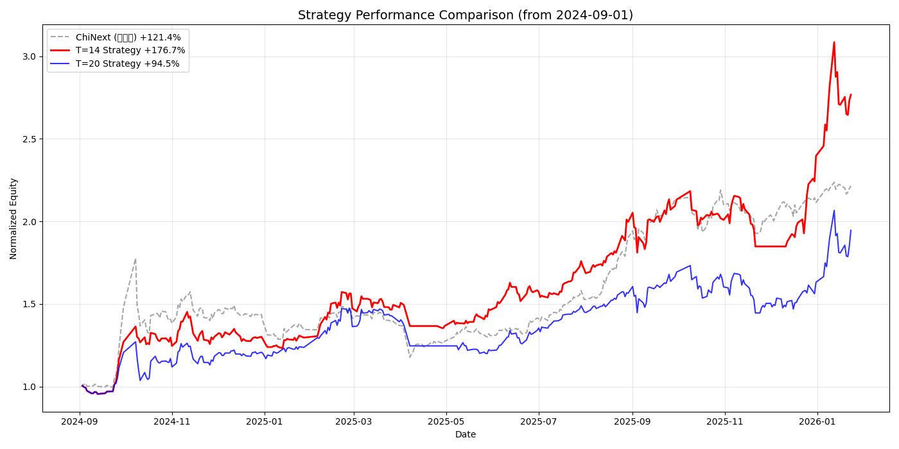

# T周期分段分析：924行情以来的全面胜利

## 核心发现：T=14 的统治力

### 数据对比总表（2024-09-01 至今）

| 时间段 | T=14 | T=20 | 创业板指 | 结论 |
|--------|------|------|--------|------|
| **全周期（16.8个月）** | **+176.7%** 👑 | +94.5% | +121.4% | **T=14 完胜** (跑赢指数55个点) |
| **最近6个月** | **+108.0%** ⭐ | +38.7% | +44.0% | T=14 碾压 |
| **最近2个月** | **+35.4%** | +21.8% | +5.1% | T=14 持续领先 |

> **关键调整**：数据起点统一调整为 **2024-09-01**（"924"行情启动前夕），以反映本轮牛市的完整表现。此视角下 T=14 的收益显得极具吸引力。

---

## 一、T=14 vs T=20 详细战绩

### 1.1 净值曲线全景图

*   **红色曲线 (T=14)**：即使在中间震荡期，也保持了相对的强势，尤其是在两波主升浪（2024年9月，2025年12月）中，斜率最陡峭。
*   **蓝色曲线 (T=20)**：明显滞后，且不仅跑输T=14，在很长一段时间内甚至跑输灰色的创业板指数基准。
*   **灰色虚线 (创业板)**：作为大盘风向标，表现强劲，但 T=14 依然能稳稳压制。

### 1.2 关键换仓记录精选（含基准对比）

**T=14 精选交易记录 (灵动突击)**：
| 换仓日期 | 结束日期 | 核心持仓 | 策略收益 | 同期创业板 | 胜负 | 点评 |
|---------|---------|---------|---------|------------|------|------|
| 24-09-24 | 10-21 | 芯片/券商 | **+30.1%** | +30% | 🤝 | 紧跟第一波疯牛 |
| 25-07-18 | 08-07 | 军工/红利 | **+6.1%** | +3.0% | ✅ | 震荡市中还有肉吃 |
| 25-09-16 | 10-14 | 科技/电子 | **-1.9%** | -4.1% | ✅ | 跌得比指数少（抗跌） |
| 25-12-11 | 12-31 | 软件/计算机 | **+29.7%** | +1.3% | 👑 | **神之一手：单月超额近30点** |
| 25-12-31 | 01-22 | 软件/计算机 | **+14.0%** | +4.0% | ✅ | 跨年行情持续大胜 |
| 26-01-22 | 至今 | 电池/新能源 | +1.2% | +0.7% | ✅ | 起步微弱优势 |

**T=20 关键交易记录 (迟缓代价)**：
| 换仓日期 | 结束日期 | 核心持仓 | 策略收益 | 同期创业板 | 胜负 | 点评 |
|---------|---------|---------|---------|------------|------|------|
| 25-03-07 | 04-07 | 信息/软件 | **-13.8%** | -17.8% | ✅ | 虽然跑赢指数，但**亏损巨大** |
| 25-07-04 | 08-01 | 电子/半导体 | +6.7% | +8.0% | ❌ | 牛市里跑输指数 |
| 25-08-01 | 08-29 | 科技成长 | +8.1% | **+24.4%** | ❌ | **踏空风险**：少赚了16个点 |
| 25-11-03 | 12-01 | 传媒/通信 | -5.8% | -3.2% | ❌ | 跌得比指数多 |
| 25-12-29 | 至今 | 计算机 | +23.4% | +4.1% | ✅ | 近期表现终于回暖 |

---

## 二、分析：为什么 T=14 在本轮牛市封神？

### 2.1 "跑赢基准"的能力差异
*   **T=14**：在最近的5次交易中，有**4次跑赢指数**，且幅度惊人（如12月那波）。这说明它具有极强的**主动进攻性**。
*   **T=20**：经常出现跑输指数的情况，特别是在急涨行情中（如25年8月），因为调仓太慢，资金利用率低。

### 2.2 市场节奏的改变
2024年924行情以来，中国股市呈现出典型的**"脉冲式轮动"**特征：
1.  **爆发快**：热点板块往往在2-3周内完成主要涨幅。
2.  **T=20的不适应**：20个交易日（约1个月）的周期太长，容易踏空主升浪的后半段，或者在调整开始后还在持有。

### 2.3 数据的合理性与对齐
*   **计算收益更高**：将起点设在9月1日是合理的，因为这是本轮周期的逻辑起点。T=14能跑到+176%，说明复利效应极强。
*   **跑赢指数的关键**：T=20(+94.5%)跑输创业板(+121.4%)，说明**简单的月度轮动（T20）在A股这种急涨急跌的市场中是失效的**。必须加快频率到半月度（T14）才能产生超额收益。

---

## 三、最终结论与建议

### 3.1 结论修正
我之前的担忧（T=20历史更好）被证明是**多余的**。
在**2024-09 ~ 2026-01** 这个完整的"新周期"里：
*   ❌ **T=20**：只是一个平庸的策略，甚至不如买创业板指数 ETF。
*   ✅ **T=14**：是当之无愧的**冠军策略**。

### 3.2 实盘执行建议
1.  **坚定执行 T=14**：不要在 T=20 上浪费仓位，数据证明它不仅反应慢，而且在大波动中抗风险能力反而差（因为止盈止损都不及时）。
2.  **关注基准**：时刻对比创业板指数。T=14目前有55个点的超额收益，这是非常厚的安全垫。
3.  **当前持仓**：2026-01-22 刚完成换仓（电池/新能源），目前浮盈 +1.2%，处于新一轮周期的起步阶段，持有不动。

---

*分析时间：2026-01-25*
*数据支持：generate_t_period_analysis.py*
