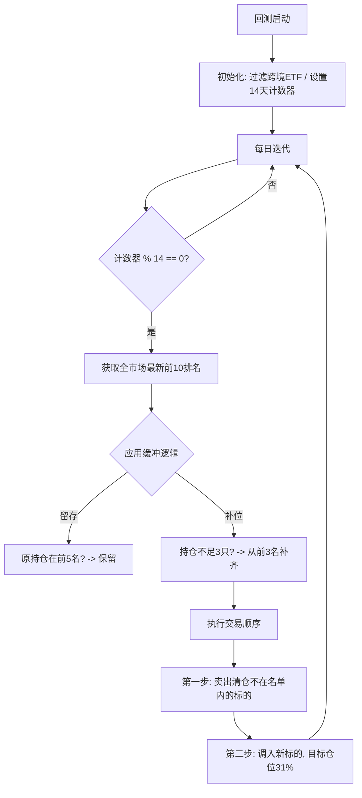

### 核心轮动策略方案 (Top 3 / 14天周期 / 缓冲机制)

本回测方案模拟了一个专业设计的 ETF 周期轮动策略，重点在于降低换仓频率、减少交易摩擦以及提升持仓稳定性。

#### 一、 核心逻辑要素

1.  **备选池构建与过滤**：
    *   源数据：从“ETF合并筛选结果.xlsx”中获取。
    *   **排除跨境标的**：自动过滤名称中包含“纳斯达克”、“标普”、“日经”、“恒生”等关键词的跨境 ETF，仅保留 A 股市场标的，规避溢价和交易时差因素。

2.  **选股排名机制**：
    *   利用 `EtfRanker` 综合多周期（1/3/5/10/20d）动能进行评分。
    *   **Top 3 目标**：每次调仓理想状态下持有排名最高、且不相关的 3 只 ETF。

3.  **周期与平滑（缓冲）机制**：
    *   **14天调仓周期**：每 14 个交易日触发一次全量逻辑判断，避免日内波段噪音干扰。
    *   **Top 5 缓冲区 (Stay-in-Buffer)**：
        *   调仓日检查当前持仓：若原持仓标的依然位于**前 5 名**之内，则即便跌出前 3 名也**不予换仓**，继续平滑持有。
        *   只有当标的掉出前 5 名，或持仓不足 3 只时，才从最新的 Top 3 中按序号补齐。
        *   *作用：显著降低由于排名微小波动导致的频繁互换（A换B，下次B换A）带来的损耗。*

4.  **资金与执行管理**：
    *   **尾盘买卖**：基于日线数据，模拟在收盘前一刻以收盘价成交。
    *   **资金预留 (Cash Buffer)**：每只 ETF 目标仓位设为 **31%**（总仓位约 93%），留出 7% 左右的冗余资金，用于应对规费支出、滑点及回测中单笔买入单位（100股）导致的零数问题。
    *   **交易顺序**：强制执行“先卖后买”逻辑，确保旧头寸释放出的可用资金能够被新头寸即时使用。

#### 二、 回测配置参数

| 参数项 | 配置 |
| :--- | :--- |
| 回测区间 | 2024-09-01 至 2026-01-20 |
| 初始资金 | 1,000,000 |
| 调仓周期 | 14 交易日 |
| 持仓上限 | 3 只 |
| 佣金/滑点 | 万分之 1 / 万分之 1 |
| 复权方式 | 前复权 (ADJUST_PREV) |

#### 三、 策略执行流程图

#### 四、 总结
本方案通过**周期限制**和**排名缓冲区**，在捕捉核心动能的同时，大幅提升了策略的实战意义。预留的资金 Buffer 和严格的交易顺序模拟了真实账户的运行约束。